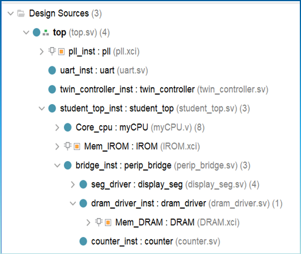
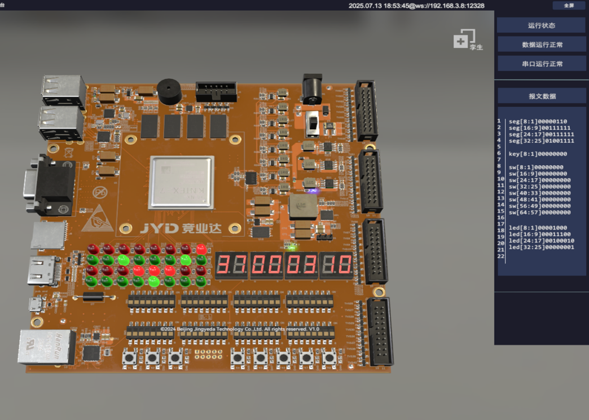
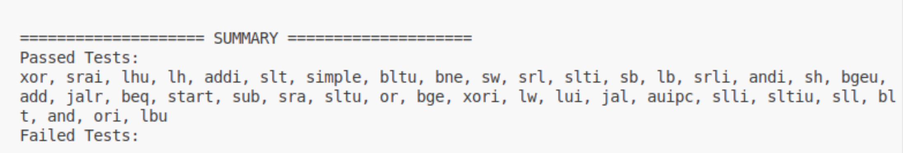

# RV32I-Pipline-CPU-trace-JYD

本仓库包含两套 RV32I 流水线 CPU 相关实现：

- `CPU/`：竞赛期间使用的三级流水线 CPU（结构：`IFU&IDU - EXU - LSU&WBU`），用于集成到竞业达 SoC 模板工程（Vivado）。
- `cdp-tests/`：竞赛结束后继续优化的验证平台与 SoC 包装（CPU 为五级流水线版本，位于 `cdp-tests/mySoC/`），用于基于 Verilator 的指令回归测试与波形生成。

---

## 目录结构速览

- `CPU/`：三级流水线 CPU（SystemVerilog）
  - 入口：`CPU/myCPU.sv`
- `cdp-tests/`：测试平台（Linux 下运行）
  - `cdp-tests/mySoC/`：五级流水线 CPU + SoC 顶层封装
    - SoC 顶层：`cdp-tests/mySoC/miniRV_SoC.v`
    - CPU 核：`cdp-tests/mySoC/myCPU.sv`
  - `cdp-tests/vsrc/`：仿真用 RAM/IROM 模型（从 `meminit.bin` 初始化）
  - `cdp-tests/csrc/`：Verilator C++ testbench（difftest）
  - `cdp-tests/golden_model/`：参考模型（C 语言实现的 RV32I 流水线模型）
  - `cdp-tests/bin/`：测试用指令镜像（`.bin`）
  - `cdp-tests/run_all_tests.py`：批量回归脚本

---

## 一、`CPU/`（三级流水线）在 Vivado SoC 模板中使用

该部分用于“竞业达 SoC 模板工程”下的 FPGA 集成。整体流程是：打开赛方/模板工程 → 添加本仓库 `CPU/` 下全部源码 → 按赛方要求配置 IP → 设置 PLL 输出 100MHz → 综合实现生成 bitstream。

### 1. 打开模板工程

1. 使用赛方要求的 Vivado 版本打开“竞业达 SoC 模板工程”。
2. 确认模板工程可以正常综合（至少能无错误打开与刷新 IP）。

### 2. 添加 CPU 源码

1. 在 Vivado 中选择：
   - `Add Sources` → `Add or Create Design Sources` → `Add Files`
2. 选择并添加 `CPU/` 目录下所有 `.sv` 文件。
3. 确认这些文件的类型为 SystemVerilog（`.sv`）。
4. 确认包含文件路径：
   - `myCPU.sv` 使用 `` `include "para.sv" ``
   - 建议在 Vivado 工程设置中把 `CPU/` 目录加入 include search path（或将 `para.sv` 设为全局 include 文件），避免 include 找不到导致编译失败。

### 3. 在 SoC 顶层中例化 `myCPU`

三级流水线版本 CPU 的模块接口（见 `CPU/myCPU.sv`）为：

- 时钟/复位：`cpu_clk`、`cpu_rst`
- IROM：`irom_addr`（输出地址）、`irom_data`（输入指令）
- 外设/数据访问接口：`perip_addr`、`perip_wen`、`perip_mask`、`perip_wdata`、`perip_rdata`

将 `myCPU` 例化到模板工程的 SoC 顶层/CPU wrapper 中，并按赛方模板定义连接到对应的 IROM/总线/外设接口。

以上工作结束后，Vivado的左侧文件结构如下图



### 4. 按赛方要求配置 IP 核

按模板/赛方要求配置相关 IP（如指令存储、数据存储、外设、调试接口等）。此仓库不强绑定具体 IP 组合，需以赛方模板要求为准。

### 5. 设置 PLL 为 100MHz

1. 在模板工程中找到赛方提供的 PLL/Clocking Wizard（或按赛方要求新建）。
2. 将 CPU 使用的时钟输出设置为 100MHz。
3. 将该 100MHz 时钟连接到 `cpu_clk`。
   ！！！注意：100MHz没有时序违例，比赛时最高可设置为150MHz，有时序违例，但能成功上板

### 6. 综合实现与上板

1. 运行综合（Synthesis）与实现（Implementation）。
2. 生成 Bitstream。
3. 下载到开发板并按赛方流程运行验证。



---

## 二、`cdp-tests/`（五级流水线 SoC + 回归测试平台）使用方法

该部分用于在 Linux 环境下，通过 Verilator 编译仿真，并用参考模型进行 difftest，从而验证 RV32I 指令集测试用例是否通过。

### 0. 环境依赖（Linux）

需要的软件通常包括：

- `verilator`
- `make`
- `g++`/`gcc`
- `python3`

以 Ubuntu/Debian 为例可安装：

```bash
sudo apt-get update
sudo apt-get install -y verilator make g++ python3
```

### 1. 获取代码并进入测试目录

```bash
git clone https://github.com/hongpengWu/RV32I-Pipline-CPU-trace-JYD.git
cd RV32I-Pipline-CPU-trace-JYD/cdp-tests
```

### 2. 编译仿真器（一次编译，多次运行）

```bash
make clean
make
```

说明：

- `Makefile` 会调用 Verilator，将 `vsrc/ram.v` 与 `mySoC/*` 作为 Verilog/SystemVerilog 源码，并把 `golden_model/` 与 `csrc/` 下的 C/C++ 文件一起编译成可执行仿真器。
- 顶层模块为 `miniRV_SoC`（见 `cdp-tests/mySoC/miniRV_SoC.v`）。
- 编译产物在 `cdp-tests/obj_dir/`。

### 3. 运行单个测试用例

例如运行 `addi`：

```bash
make run TEST=addi
```

运行时会发生：

- 通过软链接把 `bin/<TEST>.bin` 链接为 `meminit.bin`（指令/数据初始化文件名由 `Makefile` 固定为 `meminit.bin`）
- 启动 `./obj_dir/VminiRV_SoC <TEST>`
- 生成波形到 `waveform/<TEST>.vcd`

如需查看波形（可选）：

```bash
gtkwave waveform/addi.vcd
```

### 4. 批量回归全部测试

```bash
python3 run_all_tests.py
```

说明：

- 脚本会遍历 `bin/` 下所有 `.bin`，对每个用例调用：
  - `make run_for_python TEST=<case>`
- 结束后打印 `Passed Tests / Failed Tests` 汇总。

### 5. 如何判断 PASS/FAIL（重要）

该平台以“参考模型 difftest + 程序退出码”判断结果：

- 若在 difftest 中发现任意一条写回信息不一致，会打印差异并 `exit(-1)`，该用例判定为失败。
- 若程序执行到 `ecall`，参考模型会结束仿真：
  - 默认检查寄存器 `a0(x10)`：`a0 == 0` 认为测试点通过，否则认为失败。
- 若 CPU 跑飞/卡住导致长时间未结束，会触发超时（testbench 循环次数上限 1,000,000），并提示 `Timed out`。

运行成功后终端信息如下：



### 6. 常见问题排查

- `verilator: command not found`：未安装 Verilator 或 PATH 未配置。
- `ln: failed to create symbolic link`：文件系统不支持软链接或权限不足；可在 Linux 下运行，或手动把 `bin/<TEST>.bin` 复制为 `meminit.bin`（并保持文件名一致）。
- 一直 `Timed out`：通常表示 CPU 没有正确执行到结束点（例如分支/访存/异常返回/跳转等实现问题），或 difftest 输入输出不匹配导致模型侧提前退出/卡住。

---

## 三、二者关系与推荐使用方式

- 想在 FPGA 模板工程中集成并上板：优先看 `CPU/`（三级流水线）并按“Vivado SoC 模板集成流程”操作。
- 想做指令级回归验证、对照参考模型快速定位问题：使用 `cdp-tests/`（五级流水线 SoC + difftest 平台）。
