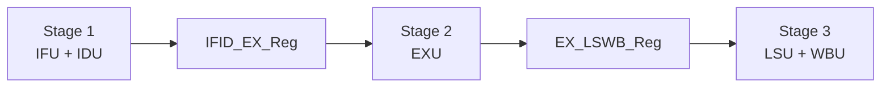
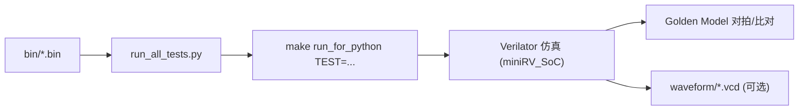

# RISC-V Three-stage CPU + Five-stage SoC Verification (RV32I)

这个仓库同时包含：

- `CPU/`：第九届集创赛参赛用 **三级流水线 CPU RTL（原始版本）**
- `cdp-tests/`：在原始版本基础上扩展的 **五级流水线 + SoC 集成 + 回归验证环境（优化版本）**

| 子项目 | 位置 | 你会用它做什么 | 推荐入口 |
| --- | --- | --- | --- |
| 三级流水线 CPU | `CPU/` | 阅读核心 RTL、理解三段流水、学习基础冒险处理 | `CPU/myCPU.sv` |
| 五级流水线 + SoC + 回归 | `cdp-tests/` | 跑回归、看波形、研究更深流水/更强前递/时序优化 | `cdp-tests/mySoC/miniRV_SoC.v` |

## 快速开始（建议从 `cdp-tests/` 走起）

```bash
cd cdp-tests
make clean && make
python run_all_tests.py
```

运行单个用例（例如 `add`）：

```bash
cd cdp-tests
make clean && make
make run TEST=add
```

### 环境依赖（最小集合）

- Verilator
- Python 3
- GNU Make
- C/C++ 编译器（例如 `g++` 或 `clang++`）

## 目录导航

- [目录结构](#目录结构)
- [1. `CPU/`：集创赛三级流水线 CPU（原始版本）](#cpu)
- [2. `cdp-tests/`：五级流水线 + SoC + 回归验证（优化版本）](#cdp-tests)
- [回归用例覆盖](#回归用例覆盖)

## 目录结构

<details>
<summary>展开查看完整目录树</summary>

```text
.
├── CPU/
│   ├── add.sv
│   ├── ALU.sv
│   ├── Control.sv
│   ├── CSR.sv
│   ├── Data_hazard.sv
│   ├── EX_LSWB_Reg.sv
│   ├── EXU.sv
│   ├── IFID_EX_Reg.sv
│   ├── IFU.sv
│   ├── IDU.sv
│   ├── LSU.sv
│   ├── myCPU.sv
│   ├── para.sv
│   ├── Reg.sv
│   ├── RegisterFile.sv
│   ├── Reg_Stack.sv
│   ├── sext.sv
│   └── WBU.sv
│
├── cdp-tests/
│   ├── Makefile
│   ├── start.dump
│   ├── asm/
│   ├── bin/
│   ├── csrc/
│   ├── golden_model/
│   │   ├── emu.c
│   │   ├── include/
│   │   ├── peripheral/
│   │   └── stage/
│   ├── mySoC/
│   │   ├── add.sv
│   │   ├── ALU.sv
│   │   ├── Control.sv
│   │   ├── CSR.sv
│   │   ├── Data_hazard.sv
│   │   ├── dram_driver.sv
│   │   ├── EXU.sv
│   │   ├── IFU.sv
│   │   ├── IDU.sv
│   │   ├── LSU.sv
│   │   ├── miniRV_SoC.v
│   │   ├── myCPU.sv
│   │   ├── para.sv
│   │   ├── Reg.sv
│   │   ├── RegisterFile.sv
│   │   ├── Reg_Stack.sv
│   │   ├── sext.sv
│   │   └── WBU.sv
│   ├── obj_dir/
│   ├── vsrc/
│   │   ├── ram.v
│   │   ├── ram0.v
│   │   ├── ram1.v
│   │   └── ram2.v
│   ├── waveform/
│   └── run_all_tests.py
│
└── README.md
```

</details>

---

<a id="cpu"></a>
## 🏛️ 1. `CPU/`：集创赛三级流水线 CPU（原始版本）

### 设计定位

`CPU/` 下是参赛版本的核心 CPU RTL。目录内以 `CPU/myCPU.sv` 为顶层，组合 IFU/IDU/EXU/LSU/WBU、CSR、寄存器堆等模块，目标是“功能正确 + 模块边界清晰 + 便于后续集成”。

### 流水线划分（按实际寄存器边界理解）

该版本通过两个显式的流水线寄存器模块，把三级流水线切成清晰的 3 段：

- `CPU/IFID_EX_Reg.sv`：把 IDU 侧的控制信号与操作数寄存到 EXU 侧，并提供清空/冲刷接口（配合分支/异常/暂停）。
- `CPU/EX_LSWB_Reg.sv`：把 EXU 的结果与访存/写回相关控制信号寄存到 LSU/WBU 侧，固定“执行结果 → 访存写回”的级间边界。



### 控制与数据冒险处理（从文件视角快速定位）

- `CPU/Control.sv`：决定 `dnpc`（跳转/分支/异常返回等）与 `IFU_stall`、`EXU_inst_clear` 等控制；包含典型的 load-use 暂停判定与流水清空联动。
- `CPU/Data_hazard.sv`：前递选择逻辑（优先 EX，再到 MEM）；当 MEM 为 load 时，前递源切到 `MEM_Rdata` 而不是 `MEM_Ex_result`，对应“load 数据在 MEM 阶段可用”的实现假设。

### 这个版本适合怎么读

- 想看顶层连线：从 `CPU/myCPU.sv` 开始。
- 想看“分支/异常/暂停/冲刷”：重点看 `CPU/Control.sv`。
- 想看“前递/冒险”：重点看 `CPU/Data_hazard.sv`。

---

<a id="cdp-tests"></a>
## 🚀 2. `cdp-tests/`：五级流水线 + SoC + 回归验证（优化版本）

### 设计定位

`cdp-tests/` 不只是 RTL：它把 CPU（`cdp-tests/mySoC/`）和验证环境（Golden Model + 测例集 + Verilator 仿真 + 自动脚本）组织成一个可持续迭代的工程目录，更适合做“回归驱动的优化与重构”。

### SoC 顶层与调试接口

- `cdp-tests/mySoC/miniRV_SoC.v`：SoC 顶层，连接时钟/复位，挂接 IROM 与 DRAM 驱动，并实例化 `myCPU`；导出 `debug_wb_*`（写回指令/PC/写使能/目的寄存器/写回值）用于外部 trace 对齐。
- `cdp-tests/mySoC/myCPU.sv`：CPU 顶层；在 IFU/IDU/EXU/LSU/WBU 的基础结构上，增加了更工程化的 `valid/ready` 级间控制，以及为更深访存流水预留/引入的中间级信号（如 `MEM_PIPE_*`、`MEM2_*`）。

### 访存通路的时序优化（LSU 的工程化取舍）

`cdp-tests/mySoC/LSU.sv` 中能直接看到面向高频目标的拆分策略：

- 关键寄存器使用 `(* max_fanout = N *)` 属性，降低高扇出导致的路由延迟风险。
- 通过 `*_pipe`、`*_wb` 等中间级寄存，把“地址/控制/数据”的长组合路径拆短，为前递与写回提供稳定的时序来源。

### 冒险检测与前递增强（支撑更深流水）

- `cdp-tests/mySoC/Data_hazard.sv`：前递选择从 2-bit 扩展为 3-bit，并把来源扩展到 `EX/MEM/MEM_PIPE/MEM2/WB`；同时更严格地用 `*_valid` 门控避免错误前递。
- `cdp-tests/mySoC/Control.sv`：把 load-use 检测扩展到更深的访存流水级（例如 `pipe_load_use`），并同步扩展 `EXU_rs1_in/EXU_rs2_in` 的选择源。

### 回归验证框架（你会实际用到的入口）

- `cdp-tests/Makefile`：使用 Verilator 构建 `miniRV_SoC`，并支持 trace 输出到 `cdp-tests/waveform/`。
- `cdp-tests/run_all_tests.py`：遍历 `cdp-tests/bin/` 下全部用例，逐个回归并汇总 Pass/Fail。



---

## 回归用例覆盖

当前 `cdp-tests/bin/` 目录已包含一组面向 RV32I 的基础指令回归用例（算术/逻辑、移位、分支跳转、访存、立即数与上位立即数等），例如：

`add/addi/sub/and/andi/or/ori/xor/xori/sll/slli/srl/srli/sra/srai/slt/sltu/slti/sltiu/lui/auipc/jal/jalr/beq/bne/blt/bltu/bge/bgeu/lb/lbu/lh/lhu/lw/sb/sh/sw`
